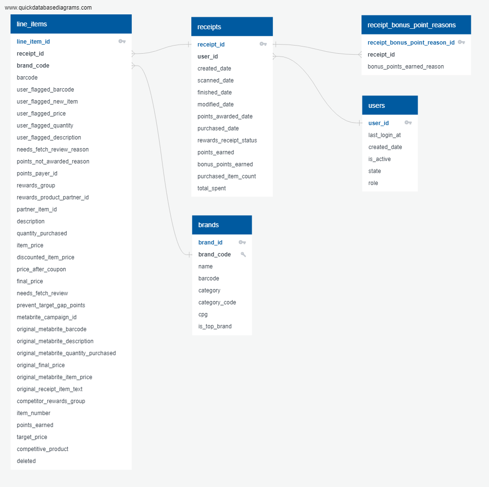

# Fetch Rewards Exercise Findings

## First: Data Model
https://app.quickdatabasediagrams.com/#/d/jCPv6V  

The [included pdf](data_model/Fetch-Exercise-Diagram-Documentation.pdf) file adds a bit of commentary about the data model.

## Second: Query that directly answers question from a stakeholder
```SQL 
Select * from here
```
## Third: Data Quality Issues
To explore the data provided and look for quality issues I typically mix manual EDA with some automated profilers. Specifically the python packages `pandas-profiling` and `missingno`. The profilers aren't always feasible with extremely large datasets so I will usually do as much as I can manually to test for:
1) Nulls
2) Blanks
3) Outliers (Basic box plots where possible)
4) Uniqueness (where desired)
5) Correct data types
6) Timezones (usually a giant headache)

For these files I was able to use the mentioned profilers and manual checking of the csvs directly (in excel) for a closer look at anything.

One issue I found has to do with the key join field of "brandCode". It is missing in 62% of line item records and in 20% of brand records. It also contains duplicate values for "HUGGIES" and "GOODNITES" in the brands dataset making it ambiguous when joining to line items.

You can see what I did to generate the csv files and profiler reports/charts in the `eda.py` file. The eda_results directory has the csv, png, and html files that the script generates per table. Note: the html files won't render directly in github so downloading them locally or cloning the entire repo is required to view them properly if desired. I didn't use a jupyter notebook this time so the pandas-profiler results aren't as easy to work with :)

## Fourth: Communicate with Stakeholders
Here is an email to a project stakeholder named "Debbie". I am imagining she provided the json files and a project brief asking the data team to create some assets for her team to answer analytical questions.
> Hi Debbie,  
> My name is Michael and I am part of the data team that's building out the analytics platform for your department. I have a few updates about the project and a few questions about the data I hope you can answer.  
>
> ### Data Questions:  
> 1. *Will you need detailed insights regarding specific reasons why a user received bonus points?* Planned testing like engagement or A/B testing that incorporates bonus points might require more detailed data than provided.
> 2. The brands data contains a reference to CPG collections. Specifically there are two distinct values for these collections: "CPGS" and "COGS". *Can you provide some more detail about what those collections are and how your team might need it for analyses?*
>
> ### Discovered Data Quality Issues:  
> We use a mixture of automated tools and manual inspection of new data to find quality issues. Our testing found the following issues:  
> 1. The field "brandCode" is used to connect line items with relevant brand details but is missing in the majority of records provided. *Is there brand information available that is tied to a product's barcode instead?*
> 2. Also in the brand table is a field named "barcode" that does not seem correct. First, it is indicated in the brief to be specific to an item but the brand table has no product details for this to make sense. Second, nearly all of the brands have this field starting with the digits '511111' which does not seem correct. *Can you help me understand why this field is included in the brands data and how it should be used?*
> ### Other data that would be useful to have:  
> 1. The brief mentioned a "partner product file". *Could we get access to those files to flesh out product details relevant to your provided data?*
> 2. We are interested in helping answer some deeper questions about the impact that being a "Top Brand" has with our users. *Do you have any historical data for what brands were featured as "Top Brands" by day?*
> ### Production and scaling concerns:  
> Based on the typical analysis questions provided in the brief the receipt, line item, and brand specific data will need to reference eachother constantly. Right now the fields we have to combine the brand and line item data are not ideal for responsive queries. We will test two methods to address this:  
> 1. Add important brand fields to the line_itmes table directly so no extra joins are required.  
> 2. Replace brand_code in the line_items table with the relevant brand_id from the brands dataset which is better for joining and indexing.
>
> Given the data quality issues raised earlier this issue might be a moot point if we can use some other dataset specific to a product's barcode to get brand information. 
> 
> Please let me know if you need clarification on any of the questions above. I look forward to hearing back from you.
>
> Best Regards,  
> Michael Skrzypiec


